# Notes on ForSE (Foreground Scale Extender)

------

<u>Work in progress codes are on the Github ForSe repository in the `workinprog` branch</u>

*Last update 2020 April 10th*

------

## **TODO**

1. *!! optimize reprojection on Healpix (Peppe)* 
2. *!! Polarization (Nico and Peppe)*
3. *!! Produce the GNILC map with gaussian small scales*
4. *Try to train the generator longer than discriminator (Nico)*
5. *inpaint point sources in HFI PySM map (Peppe) --> on hold as we have moved to GNILC* 

------

#### 

[TOC]

## Training set 

***2020 March 26th (Nicoletta)***

We aim at training the NN with Planck data. For now we are considering Planck dust in temperature, therefore the T map at 353 GHz.
To produce the training set we are considering the regions where the signal to noise of the map is higher than 8 producing a mask as follows:

* Take the full resolution Planck T map at 353 GHz
* Compute the S/N ratio considering the full resolution variance map in T
* Generate a mask that includes all the region with S/N>8
* Smooth the mask with a gaussian beam with FWHM=1° and retain everything above 0.9
* Combine the obtained mask with an isolatitude mask that cuts out everything at galactic latitude below 10° (to remove the inner part of the Galactic plane)


* The training set is then produced considering the Planck T 353 GHz map at 1° (input) and 12' (output). The training consists in 1000 (998) patches of 64x64 pixels (dimension 4°x4°). A patch is considered if at least 90% if its pixels are in the region available given the above mask

* A very messy notebook that does this is at NERSC in : `/global/homes/k/krach/scratch/NNforFG/ForSE/training_sets/make_training_set.ipynb`

* The file with the patches is in the same folder in: `training_set_998patches_4x4deg_T_HR12amin_LR1deg_Npix64_mask8.npy`  it has shape `(2, 998, 64, 64)` where the first row is the high resolution patch at 12' and the second the low res one at 1°

* Here an example:

  

  

* Another file with 358 patches of dimension 20°x20° and 320x320 pixels is in the same folder here: `training_set_358patches_20x20deg_T_HR12amin_LR1deg_Npix320_mask8.npy`

***2020 April 2nd (Nicoletta)***

I've found a bug in the way map with 320 pixels where generated (there was no correspondance with the mask due to a problem with the random seed I was passing). Now it has been corrected, there are few new files in the training folder:

1. `training_set_HFI_359patches_20x20deg_T_HR12amin_LR1deg_Npix320_mask8.npy`which has 359 patches from Planck T map at 353 GHz at 1deg and 12arcmin and can be used for train
2. `test_set_HFI_178patches_20x20deg_T_HR12amin_LR1deg_Npix320_mask8.npy`178 patches from HFI that can be used to test the NN
3. `test_set_PySM_178patches_20x20deg_T_HR12amin_LR1deg_Npix320_mask8.npy`same patches as the file before (same location) but taken from the PySM map at 12arcmin and 1deg.

------

## Training DCGAN 

***2020 March 26th (Nicoletta)***

First we use the training set generated as described above to train the DCGAN. 

I'm currently trying to update the architecture of the original DCGAN I have been using in the past, as serveral issues where present. In particular, there was a strange warning on the number of trainable parameters, probably due to the way the `trainbale=False` flag was used for the Discriminator when the Generator is trained. 

This update of the DCGAN architecture is currently done on a notebook which is here: `/global/homes/k/krach/scratch/NNforFG/ForSE/DCGAN`in the `build_dcgan.ipynb` file. 

<!--(ci sono alcune note a riguardo sul mio quaderno in data 26 Febbraio 2020)-->

It seems to work properly if the DCGAN is built in the following way:

```python
    self.discriminator = self.build_discriminator()
    self.discriminator.trainable = True
    self.discriminator.compile(loss='binary_crossentropy',
                                   optimizer=optimizer,
                                   metrics=['accuracy'])
    self.generator = self.build_generator()
    self.generator.compile(loss='binary_crossentropy', optimizer=optimizer)
    z = Input(shape=img_shape)
    img = self.generator(z)
    self.discriminator.trainable = False
    self.discriminator.compile(loss='binary_crossentropy',
                                   optimizer=optimizer,
                                   metrics=['accuracy'])
    valid = self.discriminator(img)
    self.combined = Model(z, valid)
    self.combined.compile(loss='binary_crossentropy', optimizer=optimizer)
    self.discriminator = self.build_discriminator()
    self.discriminator.trainable = True
    self.discriminator.compile(loss='binary_crossentropy',
                                   optimizer=optimizer,
                                   metrics=['accuracy'])
```
The GENERATOR, DISCRIMINATOR and COMBINED have the following number of parameters:


**<u>Important note:</u>** the above notebook on Jupyter at NERSC seems to work only with kernel `tensorflow-v1.15-0-gpu`!!!

### Results on old version of DCGAN

***2020 March 27th (Nicoletta)***

Since the first test I've run on the new version of DCGAN didn't go well (very bad generated images), I've decided to go back to the previous DCGAN and train it on the new training set. I'll try to understand what is happening with the new one once the results on the old one will be assesed. 

Note that all the following runs are computed by considering the ratio between high and low resolution patches.

Also, since there is a problem with the tensorflow-gpu on nodes at Nersc, training is done directly in the notebook which is here: `/global/homes/k/krach/scratch/NNforFG/ForSE/DCGAN/train_dcgan_on_cori.ipynb`

The validation of results is in`test_dcgan.ipynb`

***2020 March 30th (Nicoletta)***

Note: I've check whether it makes sense to use the difference between low res and high res maps instead of the ratio, but from a visual inspection of the images it doesn't seem to make much difference. Therefore I keep going with the ratio. 

------

#### **RUN #1**

***2020 March 27th (Nicoletta)***

Specification for the first run:

- `dcgan.train(epochs=100000, patches_file=patch_file, batch_size=32, save_interval=1000)`
- `optimizer = Adam(0.0002, 0.5)`
- No label smoothing
- No swap 

Results of training are at NERSC in: `/global/homes/k/krach/scratch/NNforFG/ForSE/DCGAN/test/old/run1`

After 100.000 epochs the NN seems to generate meaningful maps but, from a first inspection of the generated maps it doesn't seem to achieve the full resolution. Here an example (patch test set number 9):


However the superposition of Minkowski functionals (computed on the whole test set of 200 images) seems good, with an overlapping of 81%, 83%, 82% respectively:


**2020 March 30th (Nicoletta)***

I've applied the NN to all the large patches generated from Planck 353 GHZ temperature map: 

- Original patches are `/global/homes/k/krach/scratch/NNforFG/ForSE/training_sets/`in file `training_set_358patches_20x20deg_T_HR12amin_LR1deg_Npix320_mask8.npy`
-  Results at Nersc are in ``/global/homes/k/krach/scratch/NNforFG/ForSE/DCGAN/test/old/run1/output/output_planck_patches.npz` 
- I've copied them also on Mowgli here: `/Users/niki/Workspace/NeuralNetworks/FGss/NNforFG/ForSE/DCGAN/test/old/run1/output`
- Notebook to compute power spectra with NaMaster is the folder `/Users/niki/Workspace/NeuralNetworks/FGss/NNforFG/ForSE`file `ForSE_spectra.ipynb`

This is an example of image and power spectrum (patch 56):


Although the power spectrum doesn't look bad, I don't think the images look good, therefore optimization of the network is needed. Morover is some cases (as the one shown above) there is an excess of power at low ell.

------

#### **RUN #2**

***2020 March 27th (Nicoletta)***

Specification for the second run:

- `dcgan.train(epochs=100000, patches_file=patch_file, batch_size=32, save_interval=1000, swap=10)`

- `optimizer = Adam(0.0002, 0.5)`

- label smoothing with real in (0.7, 1) and fake in (0, 0.3): 

  ​	`target_real = np.random.uniform(0.7, 1.0, size=(half_batch, 1))`

  ​	`target_fake = np.random.uniform(0, 0.3, size=(half_batch, 1))`

- Swap of labels with 10% probability

Results of training are at NERSC in: `/global/homes/k/krach/scratch/NNforFG/ForSE/DCGAN/test/old/run2`

The situation doesn't seem to improve, with the NN which still cannot recover the full resolution. In this case the superposition of the Minkowski functinals is 79%, 81%, 81%.

------

#### **RUN #3**

***2020 March 30th (Nicoletta)***

Specification for the third run:

- `dcgan.train(epochs=100000, patches_file=patch_file, batch_size=32, save_interval=1000, swap=10)`
- `optimizer = Adam(0.0002)` I've change the optimizer
- No label smoothing
- swap at 10%

The run has been submitted with slurm using the `train_dcgan_on_cori.py`script in the usual folder

Results do not improve, with superposition of the Minkoswski functionals at the level of 71, 78, 83%. 

------

#### **RUN #4**

***2020 March 31st (Nicoletta)***

In this run I check the effect of removing batch normalization and dropout.

- `dcgan.train(epochs=100000, patches_file=patch_file, batch_size=32, save_interval=1000)`
- `optimizer = Adam(0.0002, 0.5)`
- No label smoothing
- No swap 

Also in this case it doesn't seem to improve with superposition at the level of 77, 83, 79%.

I therefore restore the batch normalization (but I don't put the dropout in the convolutional layers as I think it is not correct having them, there is dropout only in the last fully connected layer)

------

#### **RUN #5**

***2020 April 2nd (Nicoletta)***

I try to train the network directly with images of 320x320 pixels, as the problem might be in the apodization. It seems to crash with batch size of 32 due to lack of memory. Therefore I had to reduce the batch size to 16.

To train the NN I've used the new correct training set in `/global/homes/k/krach/scratch/NNforFG/ForSE/training_sets/` `training_set_HFI_359patches_20x20deg_T_HR12amin_LR1deg_Npix320_mask8.npy` (see section above)

Since now at NERSC there is the possibility to run longer jobs in the Pacific night (from 5am to 5pm in Italy), I've run the job in these hours using the command `sleep time_in_sec && sbatch file.slurm` to delay the submission.

The notebook to test results is in the usual folder in the file `test_large_patches.ipynb`

**Results below are preliminary from Epoch=24000**

I've valide results on the two test files, for HFI and PySM (`test_set_HFI_178patches_20x20deg_T_HR12amin_LR1deg_Npix320_mask8.npy` and `test_set_PySM_178patches_20x20deg_T_HR12amin_LR1deg_Npix320_mask8.npy`).

I've also change the way I normalize back images. Now I first set the mean and standard deviation to be the same as the rescaled target distribution, then I normalize back with min/max:

```python
Ss_ratio_edges = np.array(Ss_ratio_edges)
NNout_normed = np.copy(NNout)
for i in range(len(NNout)):
    NNout_normed[i] = 
    (NNout_normed[i]-np.mean(NNout_normed[i])+np.mean(Ss_ratio_scaled[i]))/np.std(NNout_normed[i])*np.std(Ss_ratio_scaled[i])
    NNout_normed[i] = (
        rescale_min_max_back(NNout_normed[i], 
        [(Ss_ratio_edges[i,0]), (Ss_ratio_edges[i,1])]))
```


Below images of the small scales only generated by the GAN for Planck test set (image 10):

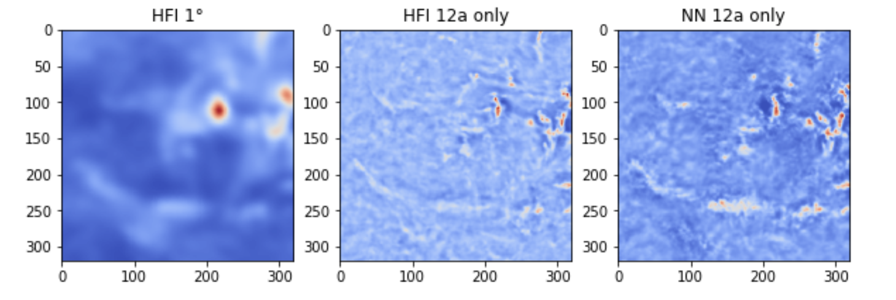

And these are the minkoswki functionals, computed on all the 178 patches of the train set, which reach a superposition of 56, 63, 84%

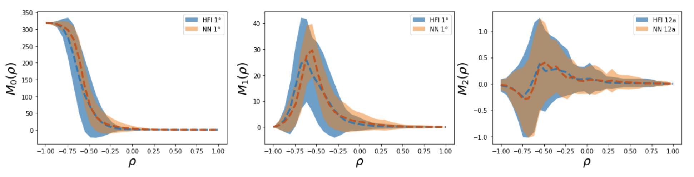

I also compare the results on PySM, considering the same patches for PySM and HFI (images 27 and 89):

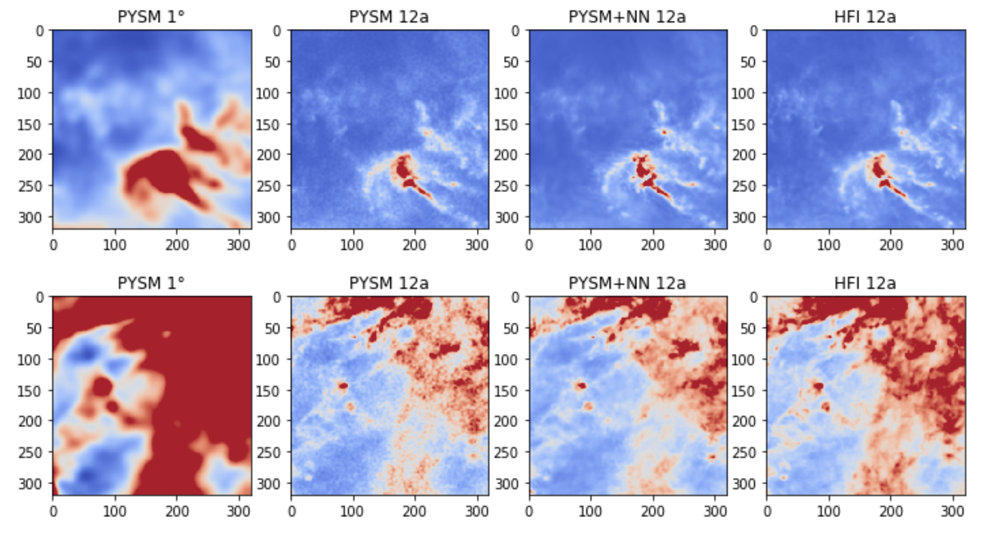

And this is the comparison of Minkowski functionals:

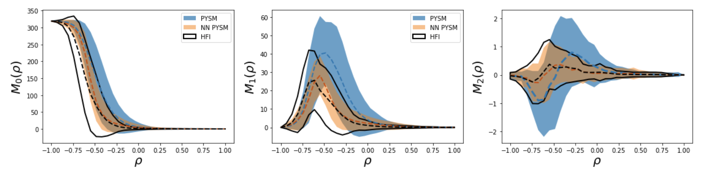

I've computed also the spectra. The file are saved in `output_run5_planck_patches_iter24000.npz`

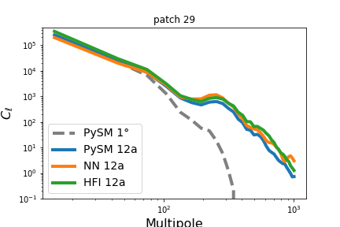 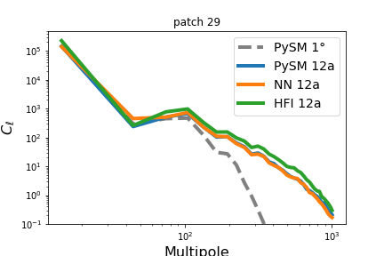

##### Full sky projection

***2020 April 10th (Nicoletta)***

Given the promising results obtained with the #RUN5 on the maps with 320x320 pixels we attempt the full sky projection in order to see how far we are from our goal. 

First we have decomposed the Healpix PySM full sky map smoothed at 1° at Nside=2048 into 20x20° (320x320 pixels) patches that cover the full sky. Patches have a superposition of 5° and the way they have been obtained is described in the dedicated section of this memos.

We have then run the DCGAN trained in #RUN5 on all these patches. This is done as usually on cori in `/global/homes/k/krach/scratch/NNforFG/ForSE/DCGAN/PySM_fullsky_patches.ipynb`. The PySM patches are in: `/global/homes/k/krach/scratch/NNforFG/ForSE/pysm_test/patches_PySM_dust_T_nside2048_fwhm1.npy`(in the same folder there is also the 12amin version). 

The obtained patches are in the same folder in file: `output_run5_pysm_patches_fullsky_iter24000.npz`

First I have inspect the output patches and computed power spectra (patch 270)

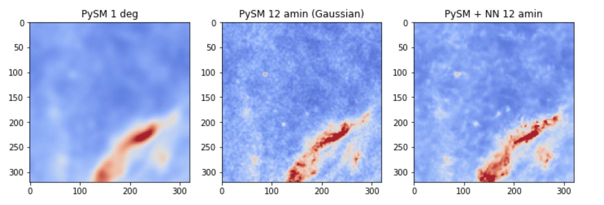

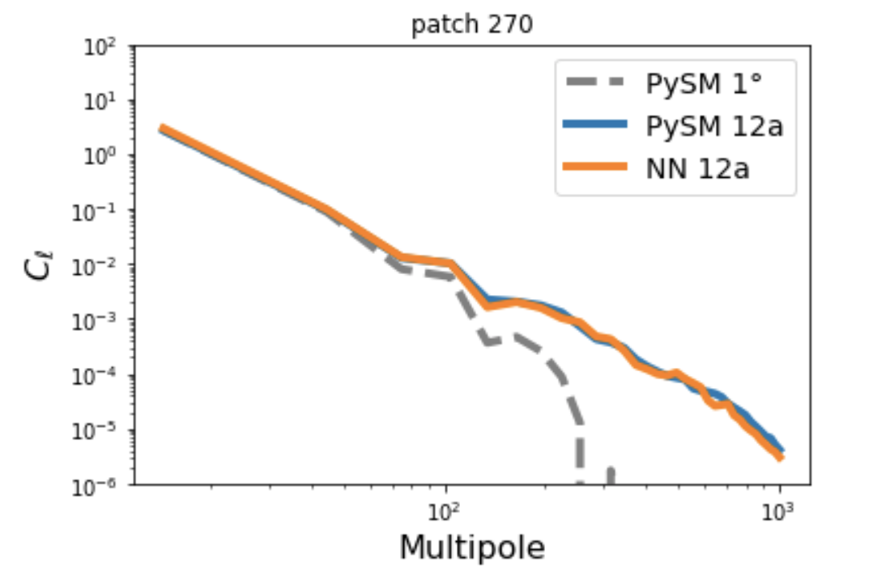

There are some problematic patches, especially the ones where point sources are present. My suspect is that the presence of point surces in the patch messes up with the proccess of normalizing back to physical units. Peppe will try to work on an inpanted version of the PySM map, in order to remove the residual point sources. 

Using the method describe on the dedicated Section we have reprojected back the patches on healpix in order to recover the full sky map. Below the full sky power spectrum which looks promising

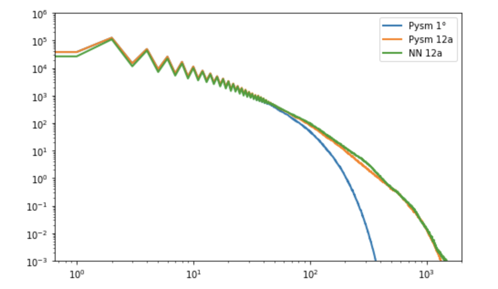

Nonetheless there are several problems which needs to be solved. Below the fractional difference between the PySM at 12' and the output from the NN. As is visible there are several patches where the difference is high (it might be due to point sources and normalization)

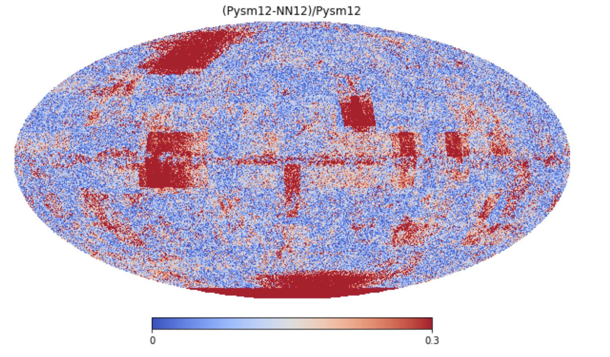

Zomming into the maps in some region is visible the border effect of the patchwork, this might be correct with an optimized apodization of the patches:


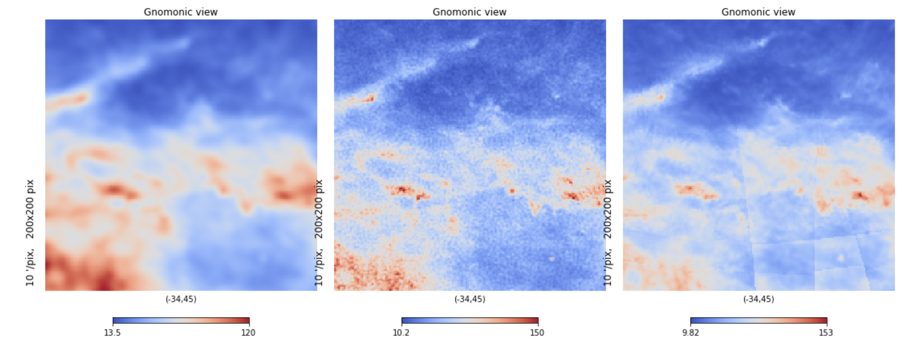

#### RUN #6

***2020 April 10th (Nicoletta)***

The GNILC Dust temperature map, from the Planck data release 2015 has two differences with respect to the COMMANDER: (i) It is clean from CIB; (ii) is at high resolution (5') in a large portion of the sky. In particular in figure 2 of https://arxiv.org/pdf/1605.09387.pdf is reported the effective angular resolution in the different region:

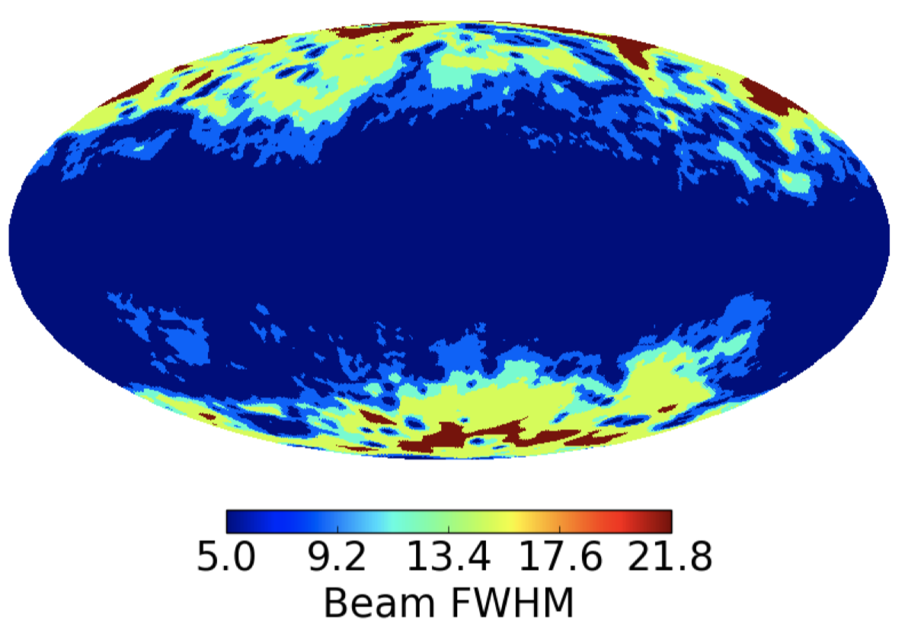

The 2018 GNILC release has two maps, one which includes TQU dust maps at angular resolution of 80' everywhere, the other which varying angular resolution. 

The GNILC maps are at NERSC in: `/global/homes/k/krach/scratch/NNforFG/maps`

In this run I try to train the DCGAN to go from GNILC_2018_T_80a to GNILC_2015_T_5a.  I get the training set on the same mask used before, obtained from Planck HFI data (not that the used mask is all included in the 5' region in the figure above). The training file is in: `training_set_GNILC_547patches_10x10deg_T_HR5amin_LR80amin_Npix320_mask8.npy`. Note that since I have to go to much higher resolution I'm using smaller patches of 10x10 degrees with still 320x320 pixels. 

Below an example of a patch in the training set:

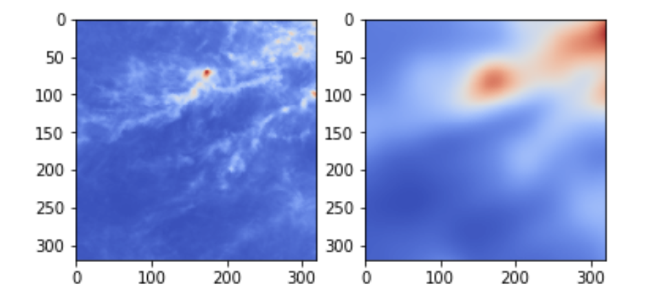


Unfortunately results on this case, look pretty bad. It could be either that the jump from 80' to 5' is too much for the network, or that a 10x10° at 80' resultion is too small. I also tried with a second training set that instead of using the 2018 map at 80' smoothed at the same resultion the map of 2015. Results are still bad (this is **RUN #6b**)

##### RUN #6d

***2020 April 14th (Nicoletta)***

Since it seems that the NN cannot go directly from 80' to 5', I try to go back to the old configuration and to go only to 12'.

In **RUN #6c** I try to go from 1° do 12' using as before patches 20x20° and 320x320 pixels. The training set is `training_set_GNILC_smt_350patches_20x20deg_T_HR12amin_LR1deg_Npix320_mask8.npy`in the training set folder.

Results seem to be good. 

Anyway since the polarization maps are available only at 80' and our final goal is to be able to use this approach in polarization I've tried also to go from 80' to 12' with the same patch dimension (this is **RUN #6d**). Training set is `training_set_GNILC_smt_350patches_20x20deg_T_HR12amin_LR80amin_Npix320_mask8.npy`.

I've train the NN for about 20 hours resulting in 110000 epochs, saving every 1000 epochs. for the resulting 110 models I've computed the minkowski functionals on the training set, and compute the superposition as well as the distance of the mean values for the 3 functionals (the code for doing this is `/global/homes/k/krach/scratch/NNforFG/ForSE/DCGAN/save_minko.py`while results are in the `output` directory in the file `minko_summary_run6d.npy`).

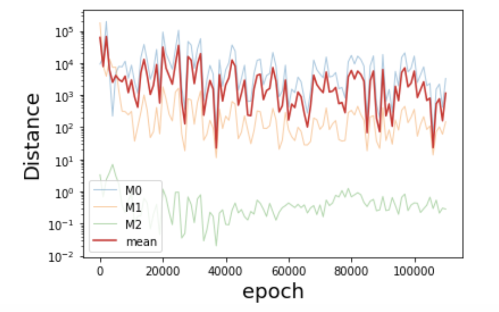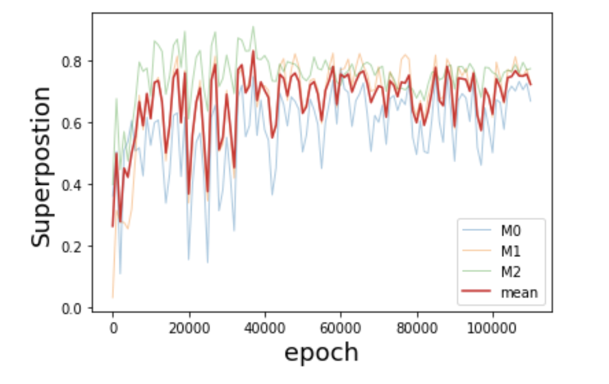

The epoch with the higher superposition and the smaller distance between the mean curves is epoch 37000, for which I report below the results.

This is patch 8 of the training set:

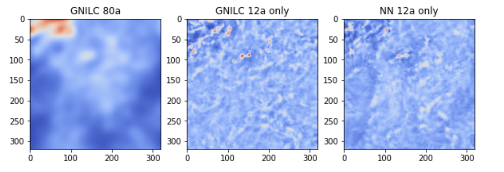

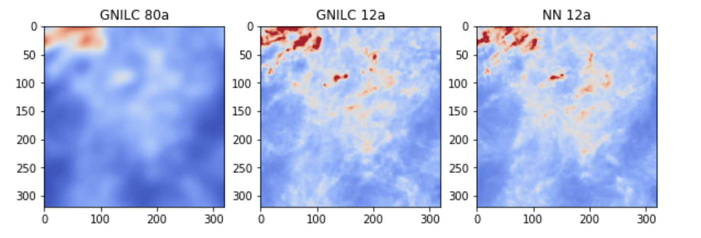

And the Minkowski functionals (these are compute on the trainig set), which reach a superposition at the level of 86, 83, 91%


and this is the power spectrum (patch 270) (file with all the patches is `output_run6d_gnilc_patches_iter37000.npz`):

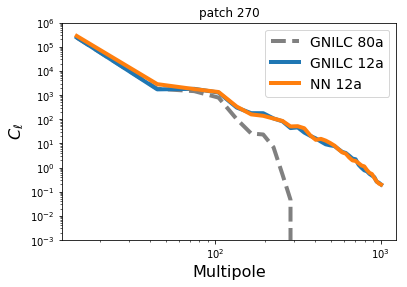

Results seem really good, we can now try to go to full sky and to move to polarization!

### Polarization

The idea (following Peppe's suggestion) is to use the NN trained in T to produce small scales in polarized intensity. We will then go back to Q and U using the large angular scale polarization angle. 


## Patchwork of the Healpix map

*Peppe could you update this part with description on how you get patches from the Healpix map and how you project them back?*

## 

