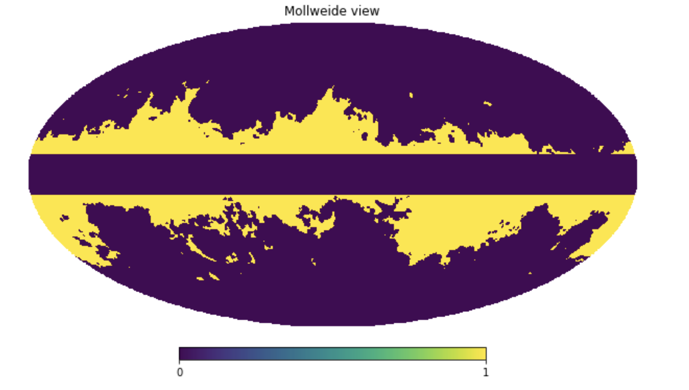
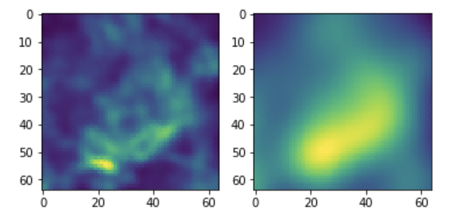
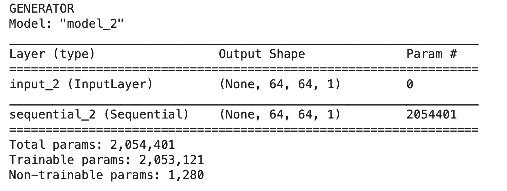
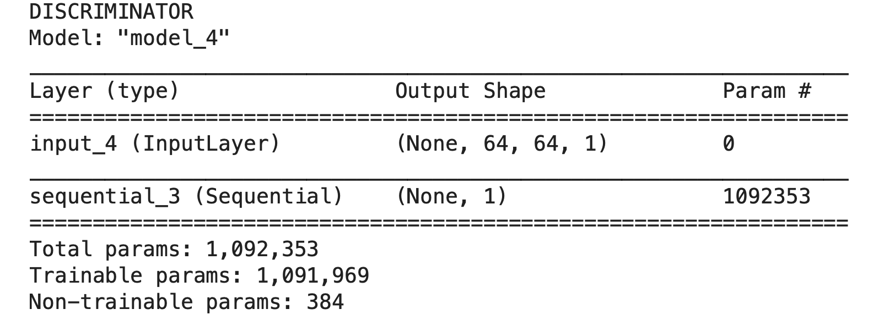
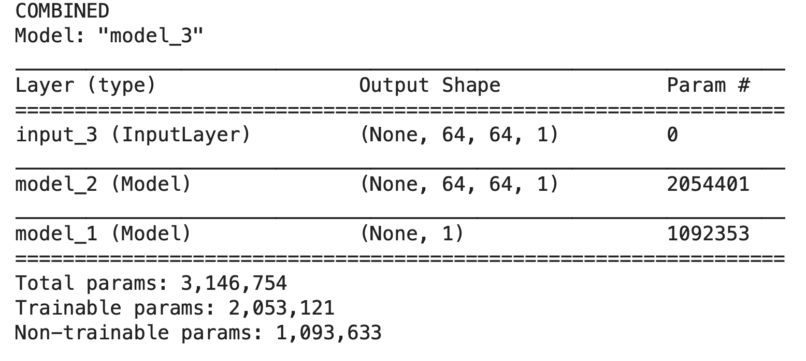
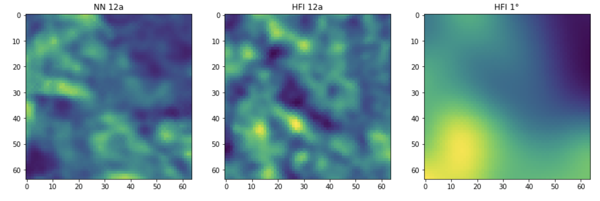
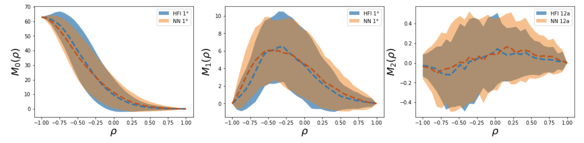
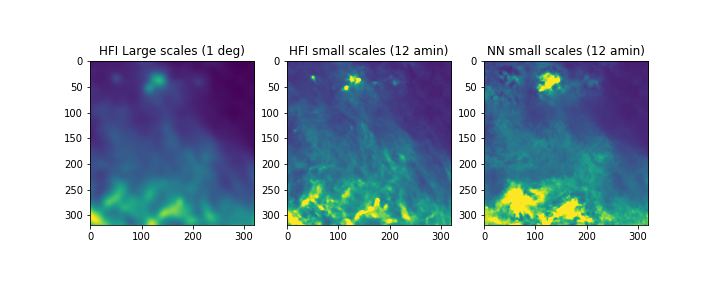
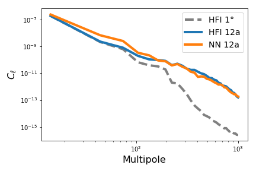

# Notes on ForSE (Foreground Scale Extender)

------

<u>Work in progress codes are on the Github ForSe repository in the `workinprog` branch</u>

*Last update 2020 March 30th*

------

[TOC]

## Training set 

***2020 March 26th (Nicoletta)***

We aim at training the NN with Planck data. For now we are considering Planck dust in temperature, therefore the T map at 353 GHz.
To produce the training set we are considering the regions where the signal to noise of the map is higher than 8 producing a mask as follows:

* Take the full resolution Planck T map at 353 GHz
* Compute the S/N ratio considering the full resolution variance map in T
* Generate a mask that includes all the region with S/N>8
* Smooth the mask with a gaussian beam with FWHM=1° and retain everything above 0.9
* Combine the obtained mask with an isolatitude mask that cuts out everything at galactic latitude below 10° (to remove the inner part of the Galactic plane)




* The training set is then produced considering the Planck T 353 GHz map at 1° (input) and 12' (output). The training consists in 1000 (998) patches of 64x64 pixels (dimension 4°x4°). A patch is considered if at least 90% if its pixels are in the region available given the above mask

* A very messy notebook that does this is at NERSC in : `/global/homes/k/krach/scratch/NNforFG/ForSE/training_sets/make_training_set.ipynb`

* The file with the patches is in the same folder in: `training_set_998patches_4x4deg_T_HR12amin_LR1deg_Npix64_mask8.npy`  it has shape `(2, 998, 64, 64)` where the first row is the high resolution patch at 12' and the second the low res one at 1°

* Here an example:

  

  

* Another file with 358 patches of dimension 20°x20° and 320x320 pixels is in the same folder here: `training_set_358patches_20x20deg_T_HR12amin_LR1deg_Npix320_mask8.npy`

------

## Training DCGAN 

***2020 March 26th (Nicoletta)***

First we use the training set generated as described above to train the DCGAN. 

I'm currently trying to update the architecture of the original DCGAN I have been using in the past, as serveral issues where present. In particular, there was a strange warning on the number of trainable parameters, probably due to the way the `trainbale=False` flag was used for the Discriminator when the Generator is trained. 

This update of the DCGAN architecture is currently done on a notebook which is here: `/global/homes/k/krach/scratch/NNforFG/ForSE/DCGAN`in the `build_dcgan.ipynb` file. 

<!--(ci sono alcune note a riguardo sul mio quaderno in data 26 Febbraio 2020)-->

It seems to work properly if the DCGAN is built in the following way:

```python
    self.discriminator = self.build_discriminator()
    self.discriminator.trainable = True
    self.discriminator.compile(loss='binary_crossentropy',
                                   optimizer=optimizer,
                                   metrics=['accuracy'])
    self.generator = self.build_generator()
    self.generator.compile(loss='binary_crossentropy', optimizer=optimizer)
    z = Input(shape=img_shape)
    img = self.generator(z)
    self.discriminator.trainable = False
    self.discriminator.compile(loss='binary_crossentropy',
                                   optimizer=optimizer,
                                   metrics=['accuracy'])
    valid = self.discriminator(img)
    self.combined = Model(z, valid)
    self.combined.compile(loss='binary_crossentropy', optimizer=optimizer)
    self.discriminator = self.build_discriminator()
    self.discriminator.trainable = True
    self.discriminator.compile(loss='binary_crossentropy',
                                   optimizer=optimizer,
                                   metrics=['accuracy'])
```
The GENERATOR, DISCRIMINATOR and COMBINED have the following number of parameters:










**<u>Important note:</u>** the above notebook on Jupyter at NERSC seems to work only with kernel `tensorflow-v1.15-0-gpu`!!!

### Results on old version of DCGAN

***2020 March 27th (Nicoletta)***

Since the first test I've run on the new version of DCGAN didn't go well (very bad generated images), I've decided to go back to the previous DCGAN and train it on the new training set. I'll try to understand what is happening with the new one once the results on the old one will be assesed. 

Note that all the following runs are computed by considering the ratio between high and low resolution patches.

Also, since there is a problem with the tensorflow-gpu on nodes at Nersc, training is done directly in the notebook which is here: `/global/homes/k/krach/scratch/NNforFG/ForSE/DCGAN/train_dcgan_on_cori.ipynb`

The validation of results is in`test_dcgan.ipynb`

***2020 March 30th (Nicoletta)***

*Note: I've check whether it makes sense to use the difference between low res and high res maps instead of the ratio, but from a visual inspection of the images it doesn't seem to make much difference. Therefore I keep going with the ratio. One thing that should be adjusted is the way I normalize back the NN maps.*  

*I could also try to change the batch size, as well as the dropout and batch normalization. Also I can try again by giving to the discriminator both large and small scales!*

*Another thing is try to train the generator longer than discriminator*

------

**RUN #1**

***2020 March 27th (Nicoletta)***

Specification for the first run:

- `dcgan.train(epochs=100000, patches_file=patch_file, batch_size=32, save_interval=1000)`
- `optimizer = Adam(0.0002, 0.5)`
- No label smoothing
- No swap 

Results of training are at NERSC in: `/global/homes/k/krach/scratch/NNforFG/ForSE/DCGAN/test/old/run1`

After 100.000 epochs the NN seems to generate meaningful maps but, from a first inspection of the generated maps it doesn't seem to achieve the full resolution. Here an example (patch test set number 9):



However the superposition of Minkowski functionals (computed on the whole test set of 200 images) seems good, with an overlapping of 81%, 83%, 82% respectively:



**2020 March 30th (Nicoletta)***

I've applied the NN to all the large patches generated from Planck 353 GHZ temperature map: 

- Original patches are `/global/homes/k/krach/scratch/NNforFG/ForSE/training_sets/`in file `training_set_358patches_20x20deg_T_HR12amin_LR1deg_Npix320_mask8.npy`
-  Results at Nersc are in ``/global/homes/k/krach/scratch/NNforFG/ForSE/DCGAN/test/old/run1/output/output_planck_patches.npz` 
- I've copied them also on Mowgli here: `/Users/niki/Workspace/NeuralNetworks/FGss/NNforFG/ForSE/DCGAN/test/old/run1/output`
- Notebook to compute power spectra with NaMaster is the folder `/Users/niki/Workspace/NeuralNetworks/FGss/NNforFG/ForSE`file `ForSE_spectra.ipynb`

This is an example of image and power spectrum (patch 56):





Although the power spectrum doesn't look bad, I don't think the images look good, therefore optimization of the network is needed.

------

**RUN #2**

***2020 March 27th (Nicoletta)***

Specification for the second run:

- `dcgan.train(epochs=100000, patches_file=patch_file, batch_size=32, save_interval=1000, swap=10)`

- `optimizer = Adam(0.0002, 0.5)`

- label smoothing with real in (0.7, 1) and fake in (0, 0.3): 

  ​	`target_real = np.random.uniform(0.7, 1.0, size=(half_batch, 1))`

  ​	`target_fake = np.random.uniform(0, 0.3, size=(half_batch, 1))`

- Swap of labels with 10% probability

Results of training are at NERSC in: `/global/homes/k/krach/scratch/NNforFG/ForSE/DCGAN/test/old/run2`

The situation doesn't seem to improve, with the NN which still cannot recover the full resolution. In this case the superposition of the Minkowski functinals is 79%, 81%, 81%.

------

**RUN #3**

***2020 March 30th (Nicoletta)***

Specification for the third run:

- `dcgan.train(epochs=100000, patches_file=patch_file, batch_size=32, save_interval=1000, swap=10)`
- `optimizer = Adam(0.0002)` I've change the optimizer
- No label smoothing
- swap at 10%

The run has been submitted with slurm and it is currently on queue


